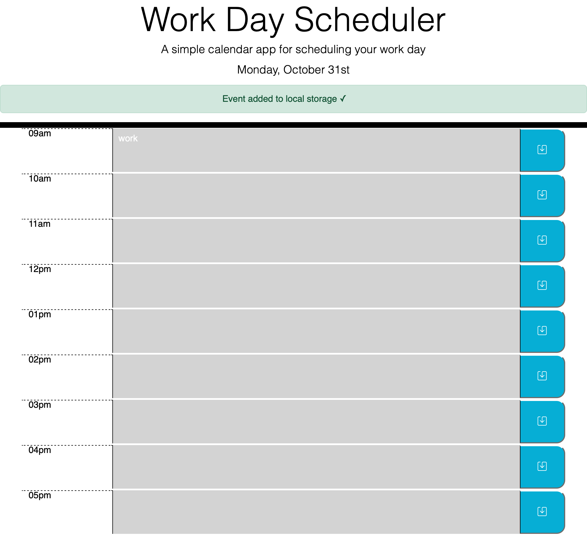

# daily-planner

## Description
The purpose of this project was to create an application that can be used to save events to a daily planner. Doing this required working with moment.js to implement time related changes to the css and html, as well as an understanding of writing and reading values from localStorage using jquery.

## Installation

N/A

## Deployed Webpage

Deployed URL: https://koreycollazo.github.io/daily-planner/

## Credits

N/A

## License

N/A
